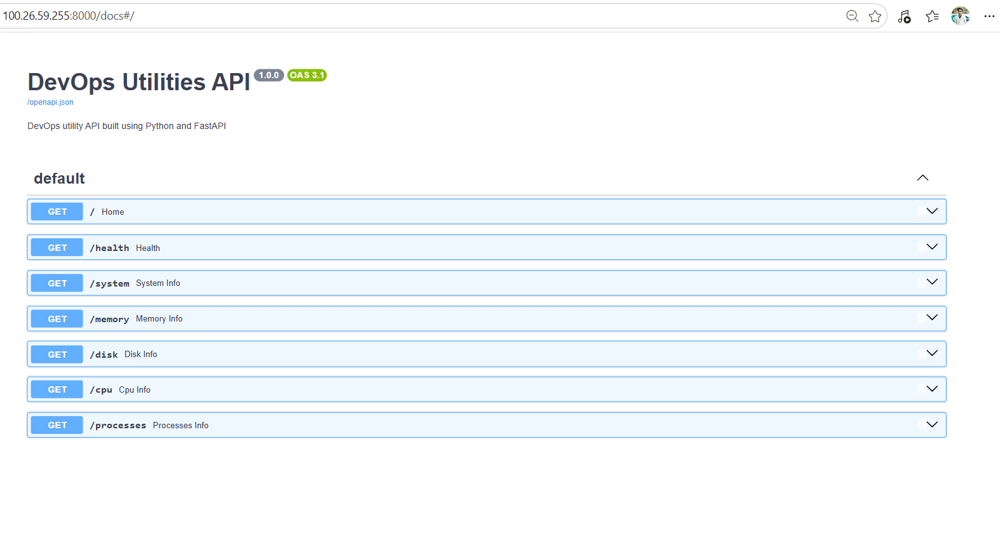
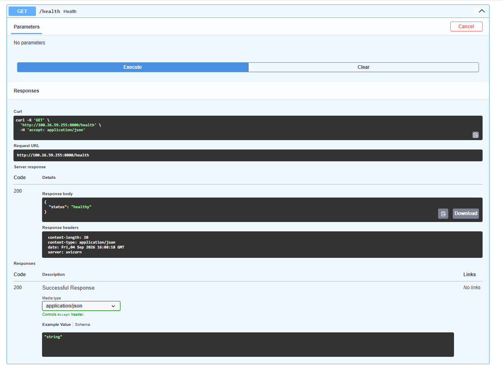
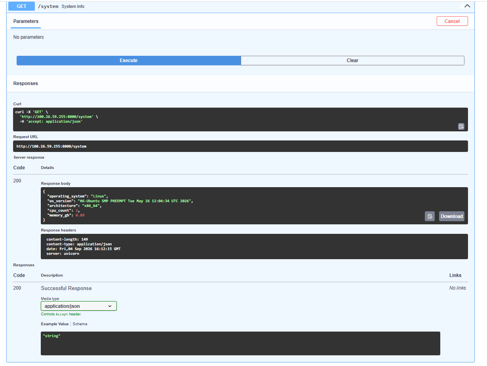
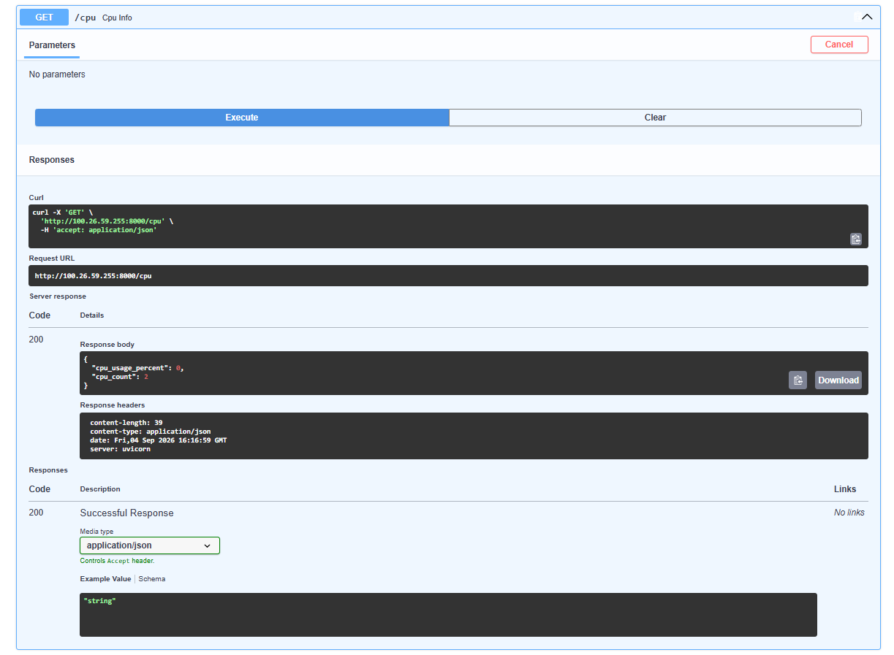
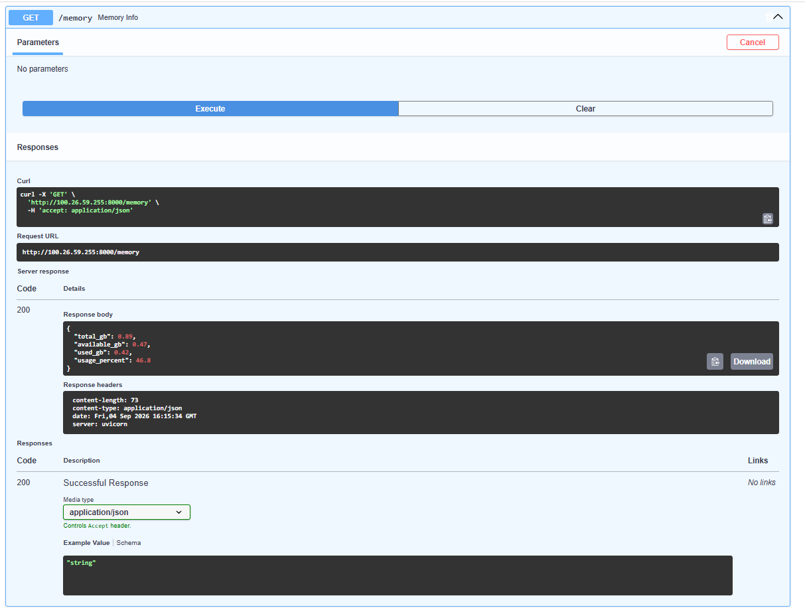
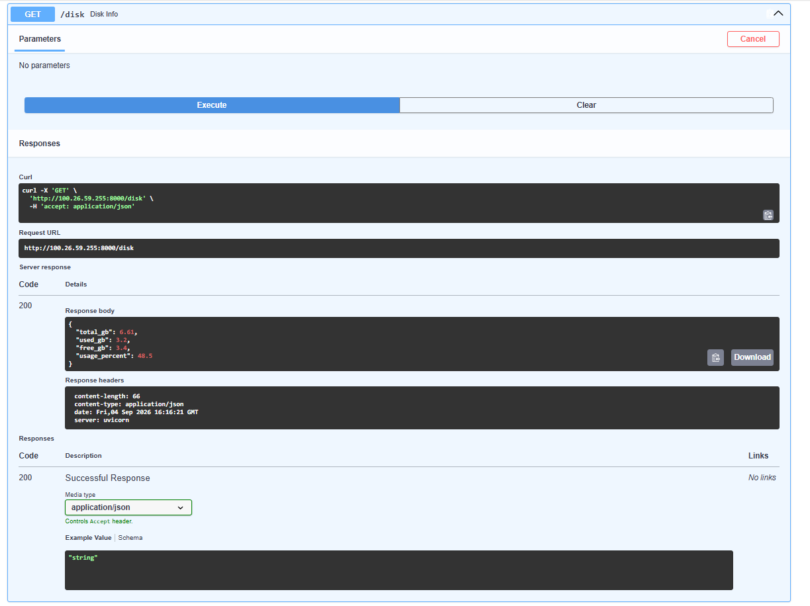
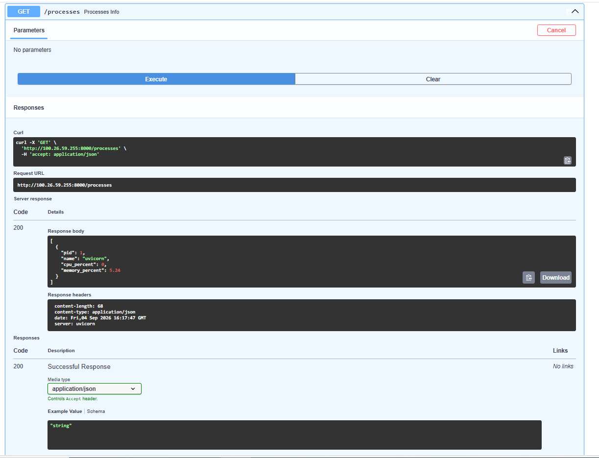
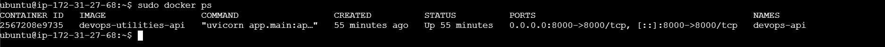

# DevOps Utilities API

A simple DevOps utility API built using **Python, FastAPI, psutil, Docker, and AWS EC2**.

This project provides REST API endpoints to monitor basic system resources such as **CPU, memory, disk usage, system information, and running processes**.

## 🚀 Features

* CPU usage monitoring
* Memory/RAM usage monitoring
* Disk usage monitoring
* System information
* Running process monitoring
* Health check endpoint
* Interactive Swagger API documentation
* Docker containerization
* Deployment on AWS EC2

## 🛠️ Technologies Used

* Python
* FastAPI
* psutil
* Uvicorn
* Docker
* AWS EC2
* Ubuntu
* Git & GitHub

## 📌 API Endpoints

| Method | Endpoint     | Description            |
| ------ | ------------ | ---------------------- |
| GET    | `/`          | Check API status       |
| GET    | `/health`    | Health check           |
| GET    | `/system`    | Get system information |
| GET    | `/memory`    | Get memory usage       |
| GET    | `/disk`      | Get disk usage         |
| GET    | `/cpu`       | Get CPU usage          |
| GET    | `/processes` | Get running processes  |

## 📂 Project Structure

```text
devops-utilities-api/
├── app/
│   ├── main.py
│   └── utils.py
├── screenshots/
├── Dockerfile
├── requirements.txt
├── .gitignore
└── .dockerignore
```

## 🐳 Run with Docker

Build the Docker image:

```bash
docker build -t devops-utilities-api .
```

Run the container:

```bash
docker run -d --name devops-api -p 8000:8000 devops-utilities-api
```

Check the running container:

```bash
docker ps
```

## ☁️ AWS EC2 Deployment

The application was deployed on an **Ubuntu AWS EC2 instance** using Docker.

Deployment flow:

```text
GitHub Repository
       ↓
AWS EC2 Ubuntu
       ↓
Docker Image
       ↓
Docker Container
       ↓
FastAPI Application
       ↓
Port 8000
```

## 📖 Swagger API Documentation

FastAPI provides interactive Swagger documentation.

Open:

```text
http://<EC2-PUBLIC-IP>:8000/docs
```

Swagger UI can be used to view and test all API endpoints directly from the browser.

## Screenshots

### Swagger API



### Health Check



### System Information



### CPU Usage



### Memory Usage



### Disk Usage



### Process Monitoring



### Docker Container



## 🔍 Troubleshooting

During deployment, the `/disk` endpoint initially returned an error because the application was using a Windows path:

```python
psutil.disk_usage("C:\\")
```

Since the application was running inside a Linux Docker container on AWS EC2, the path was changed to:

```python
psutil.disk_usage("/")
```

The Docker image was then rebuilt and the container was redeployed successfully.

## 🔮 Future Improvements

* Add authentication
* Add CPU and memory threshold alerts
* Add logging
* Add Prometheus metrics
* Add monitoring dashboard using Grafana
* Add CI/CD pipeline in a future version

## 👨‍💻 Project Purpose

The main purpose of this project is to demonstrate practical knowledge of **Python API development, system monitoring, Docker containerization, Linux, AWS EC2 deployment, and Git/GitHub**.
